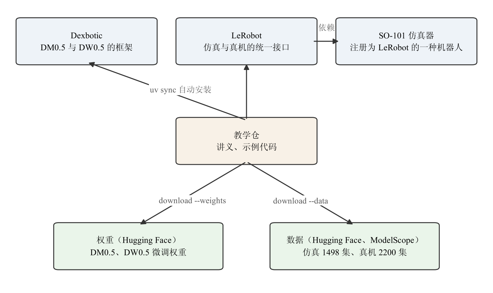
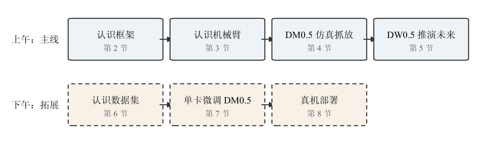
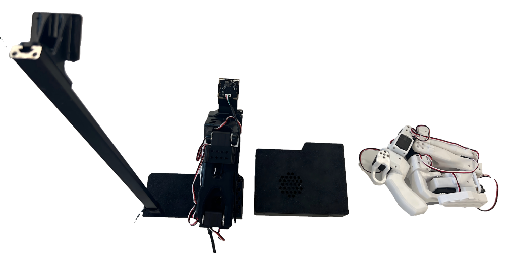
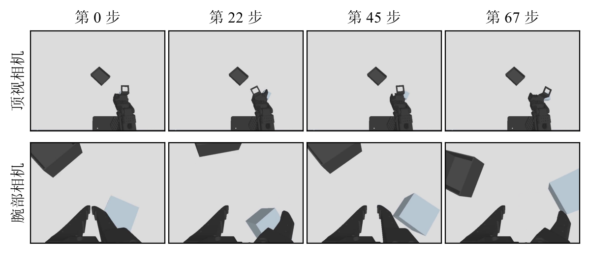
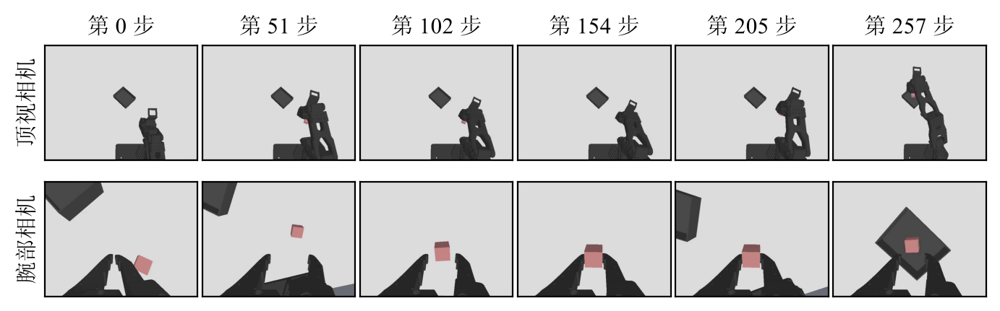
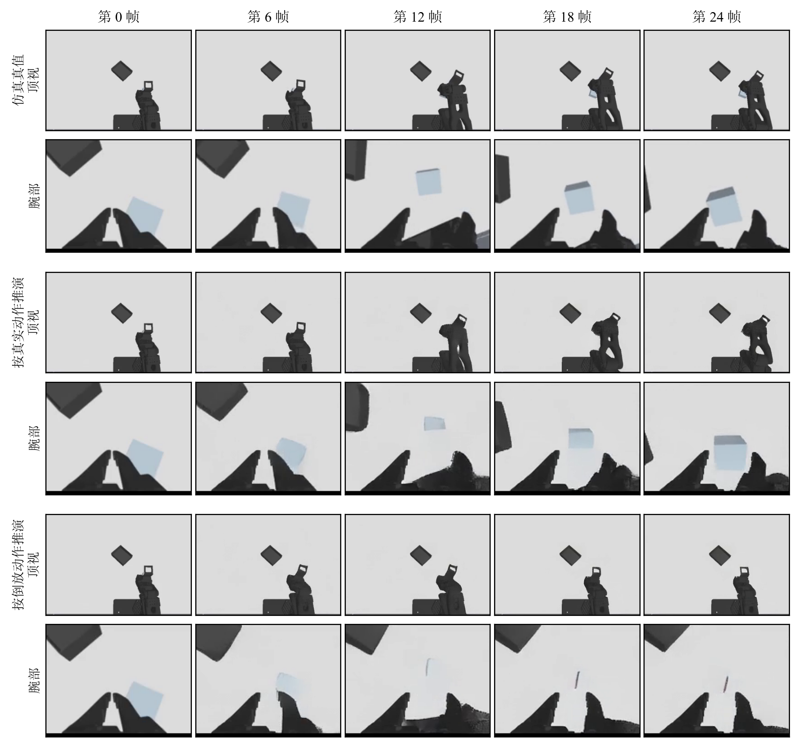
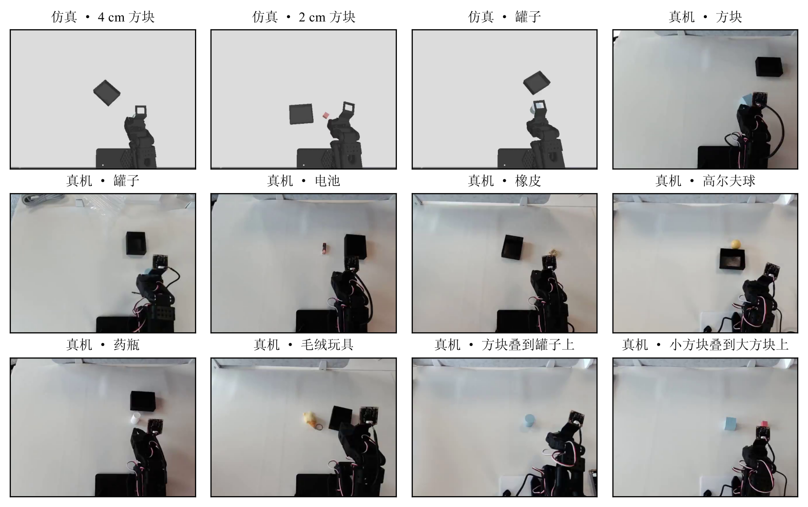
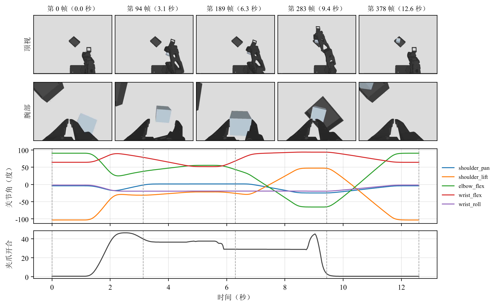
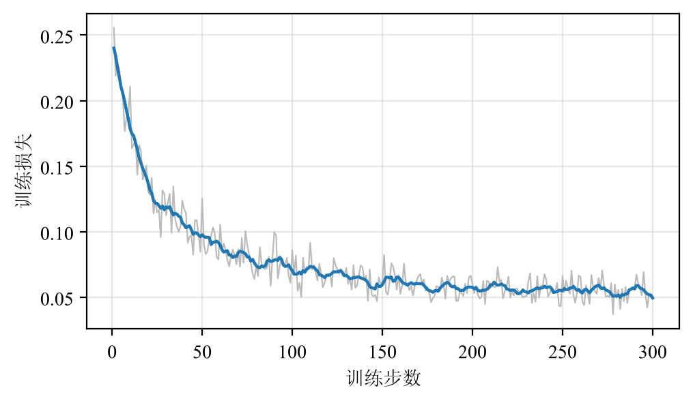

这份讲义配合 Xbotics 与原力灵机联合举办的一天工作坊。一天里我们只做一件事：把两个开源的具身基础模型真正用到一台机械臂上。一个是视觉-语言-动作模型（Vision-Language-Action，VLA）DM0.5，看画面、听指令、出动作；一个是世界模型 DW0.5，给它一串动作，它画出照这串动作做下去会看到的画面。平台是 SO-101 单臂机械臂和它的仿真器，任务是把桌上的物体抓起来放进料箱。

讲义自成一体，不要求读过别的材料；会用 Linux 命令行和基本的 Python 即可。所有命令都能照着敲，所有数字都来自同一套公开代码和公开权重的实测。

# 1 今天要做什么

## 1.1 三类资源

整个工作坊只用到三类资源：

| 资源 | 链接 |
| --- | --- |
| 讲义 | 就是这份文档，也在教学仓的 `lecture/pdf/` 下 |
| 代码 | [教学仓 Xbotics-Dexmal-Workshop](https://github.com/Xbotics-Embodied-AI-club/Xbotics-Dexmal-Workshop) |
| 数据与权重 | [DM0.5 权重](https://huggingface.co/Harrysunshine/so101-dm05-lora-sim-real-10task)、[DW0.5 权重](https://huggingface.co/Harrysunshine/so101-dw05-sim-real-10task)、[仿真数据](https://huggingface.co/datasets/Harrysunshine/so101-sim-pickplace-v2)、[真机数据](https://modelscope.cn/datasets/zhuzhuangtian/so101-pick-place-tasks) |

代码只有教学仓一个，装它的时候会自动从 GitHub 取来它依赖的两个项目：模型框架 Dexbotic 和机器人接口 LeRobot。SO-101 仿真器又是 LeRobot 的依赖：它把自己注册成 LeRobot 里的一种机器人，随 LeRobot 一起装上。这些都不需要分别下载、分别安装。权重和数据由教学仓里的下载命令取回，权重上午就要用，数据到第 6 节才用。图 1 画出了它们的关系。

{width=90%}

## 1.2 一天的路线

{width=100%}

图 2 是一天的路线。上午认识工具：先装好 Dexbotic 框架（第 2 节），再认识星禾套件里的 SO-101 机械臂和它的仿真器，让仿真里的机械臂动一动（第 3 节）。然后认识两个模型，并用在 SO-101 数据上微调好的权重在仿真里推理：DM0.5 抓放（第 4 节），DW0.5 推演未来（第 5 节）。下午是拓展内容：了解训练数据（第 6 节），在一张卡上微调一次 DM0.5 并部署自己训出的模型（第 7 节），最后把同一套代码接到真机上（第 8 节）。

## 1.3 本节小结

今天的主线是“认识工具、用发布的模型推理”，训练和真机是拓展。要记住的只有三类资源：讲义、代码（教学仓）、数据与权重。

# 2 Dexbotic：框架与安装

## 2.1 Dexbotic 是什么

Dexbotic 是原力灵机开源的视觉-语言-动作模型工具箱[1]。它要解决的问题是：各家的 VLA 模型用着不同的框架、不同的数据格式，想比较或复现几个模型，就得配好几套环境。Dexbotic 把它们统一到同一个代码库里，有三个做法贯穿始终。

第一，**模型统一拆成两部分**：视觉-语言主干和动作专家。主干由视觉编码器和大语言模型组成，负责看图、读指令；动作专家接在主干后面，负责生成动作。不同的 VLA 模型，差别主要在动作专家是什么结构。

第二，**实验以脚本为中心**。每个实验是一个 Python 配置文件，只写与默认配置不同的那几项；训练和推理服务都从这个文件启动。本工作坊的 DM0.5 和 DW0.5 各有一个这样的配置，放在 `dexbotic.so101` 里。

第三，**统一的数据格式 Dexdata**。不同机器人的数据都转成同一种格式：每一集一个 jsonl 标注文件，逐帧记录关节状态、动作和指令，画面仍然引用原来的视频文件。第 6 节会亲手做一次这种转换。

DM0.5 和 DW0.5 都在 Dexbotic 里：本工作坊用的版本把原力灵机的 DM0.5 工具箱与 DW0.5 世界模型[2][3]合并进同一个框架，并加上了 SO-101 这台机器人的数据转换、训练与评测。

## 2.2 三步安装

需要一张 32 GB 显存的 NVIDIA 显卡（现场是 RTX 5090）。先确认驱动够新：运行 `nvidia-smi`，右上角的 CUDA Version 不低于 12.8 即可。再装好 Python 项目管理工具 uv：

```bash
curl -LsSf https://astral.sh/uv/install.sh | sh
```

然后三步：

```bash
# 第一步：装仓库（一个环境装好 Dexbotic、仿真器与 LeRobot）
git clone https://github.com/Xbotics-Embodied-AI-club/Xbotics-Dexmal-Workshop.git
cd Xbotics-Dexmal-Workshop
uv sync

# 第二步：下权重（两份微调权重，加上 DW0.5 推理要用的基座组件）
uv run python -m dexmal_workshop.download --weights

# 第三步：下数据（第 6 节才用，可以先跳过）
uv run python -m dexmal_workshop.download --data
```

`uv sync` 把 Dexbotic、LeRobot 以及 LeRobot 所依赖的仿真器从各自的 GitHub 仓按固定版本装进同一个环境，同时装好 PyTorch 等依赖；这几个项目之间的版本冲突教学仓已经处理好，学员不需要管。权重和数据都放在 `~/so101_workspace/` 下，设环境变量 `SO101_ROOT` 可以换到别处。现场的机器已经提前装好、下好，三步都是课后在自己机器上复现时才需要。

之后所有命令都在教学仓目录下用 `uv run` 执行，它会自动使用刚才装好的环境。装好之后，Dexbotic、仿真器和本工作坊的代码都可以直接 `import`，第 3.4 节就会用到。

## 2.3 本节小结

Dexbotic 把 VLA 模型统一成“主干 + 动作专家”，用脚本管理实验，用 Dexdata 统一数据。安装只有三步：装仓库、下权重、下数据。

# 3 星禾套件：SO-101 真机与仿真器

## 3.1 星禾套件与 SO-101 机械臂

星禾套件是 Xbotics 做的一套桌面级具身智能训练平台，把数据采集、模型训练、部署和评测这一整条链路需要的东西装进一个箱子。它由四部分组成，缺了哪一部分链路都不完整：

| 组成 | 作用 |
| --- | --- |
| 主从两台 SO-101 机械臂 | 白色主臂带握把，人手握着它示教；黑色从臂跟着主臂动，负责执行。采数据时两台一起用，部署模型时只用从臂 |
| 两路相机 | 顶视相机装在立柱顶端，俯视整个工作区；腕部相机装在从臂夹爪上，随夹爪一起动 |
| 端侧计算平台 | 一台小机箱，负责驱动舵机、采集相机画面、录制数据；跑大模型时它只管机械臂和相机，模型在 GPU 主机上算，动作经网络传回来 |
| so101-sim 仿真器 | 按真机标定的 SO-101 仿真器，第 3.2 节细讲 |

{width=80%}

图 3 是套件实物。今天在工作坊上，模型部署只用到从臂和两路相机；主臂是采集训练数据用的，第 6 节的真机数据就是用这套设备遥操作录下来的。

SO-101 是一台桌面级单臂机械臂，五个关节加一个夹爪。它的状态是六个数，依次是 `shoulder_pan`（底座旋转）、`shoulder_lift`（大臂俯仰）、`elbow_flex`（肘）、`wrist_flex`（腕俯仰）、`wrist_roll`（腕旋转）五个关节的角度（单位：度），加 `gripper` 夹爪开合（0 到 100 的行程百分比，0 为合拢）。控制它就是给这六个数的目标值。机械臂上装两路相机：一路从上方看整个桌面（顶视），一路装在手腕上看夹爪前方（腕部），分辨率都是 640×480，每秒 30 帧。

## 3.2 仿真器

仿真器基于 ManiSkill3[4] 搭建，和真机用同一份机器人模型文件，物体尺寸、运动速度、相机位置与内参、关节名称和单位都按真机标定，所以仿真里录的数据能和真机数据混进同一次训练（第 6 节）。它做了三个抓放场景。命令里用第二列的名字选场景：

| 场景 | 命令里的名字 | 难点 |
| --- | --- | --- |
| 4 cm 方块 | `cube40` | 基础场景 |
| 2 cm 方块 | `cube20` | 物体小，夹持余量少，稍一偏就滑出 |
| 罐子 | `cylinder40` | 圆面，接触点少，夹歪了容易转 |

每一局里物体和料箱的位置随机摆放。成功与否由仿真器自己判定：物体的水平位置落在料箱开口范围内、机械臂没有碰着物体、机械臂没有碰着料箱、机械臂已经静止，四条同时满足才算。

## 3.3 一个接口驱动两种机器人

真机和仿真器看上去完全不同，但对控制程序来说，它们是同一种东西：一台“机器人”。我们用 LeRobot[5] 的机器人接口来表达这件事，它只有两个核心操作：

| 操作 | 作用 | 内容 |
| --- | --- | --- |
| `get_observation()` | 读一帧观测 | 六个关节读数（键名如 `shoulder_pan.pos`），外加 `top`、`wrist` 两路画面 |
| `send_action(action)` | 下发一步动作 | 六个关节的目标值，键名同上 |

真机由 LeRobot 自带的 SO-101 驱动实现这两个操作；仿真器则把自己注册成 LeRobot 里一种叫 `so101_sim` 的机器人，也实现这两个操作，这正是它作为 LeRobot 依赖装进来的原因。两边的键名、单位完全一样，于是后面的控制程序只写一份：在仿真里跑通的代码，换一个参数就能驱动真机。这里只把 LeRobot 当成机器人的硬件接口来用，模型和推理服务都来自 Dexbotic。

## 3.4 动手：让仿真里的机械臂动一动

```bash
uv run python -m dexmal_workshop.hello_sim
```

这个脚本造出一台仿真的 SO-101，读一帧观测，然后在 3 秒里让手腕左右转一个来回、夹爪开合两次，把两路画面存成录像 `hello_sim.mp4`。自己在 Python 里试，只要几行（用 `uv run python` 进入交互环境）：

```python
from dexmal_workshop.robots import make_sim

robot = make_sim("cube40")                 # 一台由仿真扮演的 SO-101
robot.connect()
obs = robot.get_observation()              # 六个关节读数 + 两路画面
print({k: round(obs[k], 1) for k in robot.action_features})
target = {k: obs[k] for k in robot.action_features}
target["wrist_roll.pos"] += 30             # 手腕的目标转 30 度
for _ in range(30):                        # 每次 send_action 只走一步（1/30 秒），连发 30 步
    robot.send_action(target)
print(robot.get_observation()["wrist_roll.pos"])
robot.disconnect()
```

{width=100%}

图 4 是录像中的几帧。腕部相机随手腕一起转，所以下行画面整体旋转；夹爪张开又合上。运行时脚本还会打印六个关节的读数和这个场景的任务指令，可以对照 3.1 节看看每个数的含义。

## 3.5 本节小结

SO-101 的状态和动作都是六个数，两路相机分别看桌面和夹爪前方。仿真器与真机实现同一个 LeRobot 机器人接口，所以控制程序只写一份。

# 4 DM0.5：原理与仿真部署

## 4.1 从 DM0 说起：“具身原生”的训练思路

DM0.5 是原力灵机 DM 系列的第二代。要理解它，先看第一代 DM0 的论文[8]提出了什么问题。

当时主流的 VLA 做法是“先预训练、再适配”：先拿海量互联网图文数据训练一个视觉-语言模型，让它学会看图说话，再用少量机器人数据微调，教它输出动作。问题在于，互联网图文里几乎没有“物理”——没有连续的运动、没有空间里的相对位置变化、没有动作和后果之间的因果。模型的语义知识很丰富，却缺少物理直觉；硬用机器人数据去教，又容易把原来学会的语言与推理能力冲掉（称为**灾难性遗忘**）。

DM0 的回答是“**具身原生**”（Embodied-Native）：从预训练的第一天起，就把机器人数据当成和图文同等重要的数据来源。图 5 是 DM0 预训练用到的数据：上半部分是常规的多模态网络数据（常识、文字识别、教育题目、目标定位、视觉问答、图形界面），下半部分是具身数据和自动驾驶数据——后两类提供的正是图文里缺少的空间关系与物理动态。

![DM0 的预训练数据：多模态网络数据、具身数据与自动驾驶数据混在一起训练（图取自 DM0 论文[8]图 1）](figures/fig-09-dm0-data.png){width=85%}

训练分三个阶段，一步步从“通用”收窄到“能上机”：

| 阶段 | 训练什么 | 数据 |
| --- | --- | --- |
| 预训练 | 只训视觉-语言模型，打下看图、识字、定位和空间理解的底子 | 约 1.2 万亿 token 的网络、驾驶与具身数据 |
| 中训练 | 接上动作专家，开始学输出动作；同时继续用图文数据训练，防止语言能力退化 | 仿真与多种单臂、双臂机器人数据，加图文与具身推理数据 |
| 后训练 | 把机器人数据收窄到少数几种目标机器人，让动作更精准 | 目标机器人数据，加少量图文数据 |

论文里还有两个配套设计。一是**混合梯度**：训练机器人数据时，动作专家的梯度不回传进视觉-语言模型，保护它已经学会的语义知识；而视觉-语言模型仍然继续从图文数据学习。二是**具身空间脚手架**：让模型在给出动作之前，先依次说出“当前子任务是什么”“目标物体在画面哪里（画个框）”“夹爪接下来在画面里怎么走（画条轨迹）”，从抽象到具体一层层逼近动作，缩小动作的搜索空间。

本工作坊相当于在这三个阶段之后再加一步：用 SO-101 的数据做 LoRA 微调（第 7 节）。这一步只用下一节讲的动作损失。

## 4.2 DM0.5 的结构

![DM0 的结构：左侧视觉编码器把多路画面变成视觉 token，与机器人状态、指令一起送进大语言模型；右侧动作专家从噪声出发生成连续动作。上方五格是论文里辅助训练用的输出：子任务、目标框、夹爪轨迹、离散动作与连续动作（图取自 DM0 论文[8]图 2）](figures/fig-10-dm0-arch.png){width=100%}

图 6 是论文中 DM0 的结构，DM0.5 沿用了同样的“主干 + 动作专家”骨架（即第 2.1 节说的那种拆法），只是各部分换成了更大的模型。下表对照两代的配置，DM0.5 一栏读自它发布的配置文件：

| | DM0 | DM0.5 |
| --- | --- | --- |
| 视觉编码器 | PE，约 4 亿参数 | SigLIP，27 层；每张图缩放到 448×448，变成 256 个视觉 token |
| 大语言模型 | Qwen3-1.7B | Gemma3-4B（34 层，宽 2560） |
| 动作专家 | 约 3 亿参数 | 34 层 Transformer，宽 1024 |
| 一次输出 | 50 步动作 | 50 步动作，每步 32 维（SO-101 只用前 6 维，其余补零） |

**输入怎么变成 token。** 两路画面各变成 256 个视觉 token；任务指令照常分词；比较特别的是关节状态：DM0.5 不把六个数直接当向量喂进去，而是把每一维量化成 0 到 255 之间的一个整数，以 `States:` 开头写成一段文字，放进提示词。机器人类型也以文字形式写在里面。这样主干看到的全是它熟悉的 token 序列。

**动作专家怎么“读”主干。** 动作专家和大语言模型层数相同（都是 34 层）。第 $i$ 层里，动作专家的每个动作 token 不仅互相做注意力，还能看到主干第 $i$ 层对画面、指令、状态算出的键和值（K/V）；反过来，主干看不到动作 token。这种单向、逐层的连接带来一个好处：主干对一帧观测只需要算一遍，把各层的 K/V 缓存下来，动作专家接下来的 10 步迭代都复用这份缓存，推理就快得多。

**流匹配：从噪声推出动作。** 动作专家不是一步回归出动作，而是用**流匹配**（flow matching）一步步“推”出来。记真实的动作块为 $a$（50×32 的矩阵），$\varepsilon$ 为同样大小的标准高斯噪声，$t \in [0,1]$ 表示“噪声程度”。训练时随机抽一个 $t$，把两者按比例混合：

$$
x_t = t\,\varepsilon + (1-t)\,a
$$

$t=1$ 时 $x_t$ 是纯噪声，$t=0$ 时就是真实动作。网络 $v_\theta$ 看着 $x_t$、$t$ 和主干的 K/V，要预测从动作指向噪声的“速度” $\varepsilon - a$，损失是两者的均方误差：

$$
\mathcal{L} = \big\| v_\theta(x_t, t) - (\varepsilon - a) \big\|^2
$$

推理时反过来走：从一段纯噪声 $x_1$ 出发，把 $[0,1]$ 分成 10 小段，每一步沿预测的速度往回退一小段，$x_{t-\Delta t} = x_t - \Delta t \cdot v_\theta(x_t, t)$，走到 $t=0$ 就得到 50 步动作。直观地说，每一步都把这段“动作”往更合理的方向推一点。

**时间怎么告诉网络。** 同一个网络要在不同的 $t$ 下做不同的事（$t$ 大时只需给出大致方向，$t$ 小时要修细节），所以每一步都要告诉它当前的 $t$。DM0.5 的做法是把 $t$ 编码成一个向量，再经过每一层专门的**时间调制层**，算出这一层归一化之后的缩放、平移和门控系数（称为 adaRMS）。第 7 节 LoRA 微调时，这些时间调制层是整体放开训练的。

我们用 SO-101 的仿真与真机数据对 DM0.5 做了 LoRA 微调，发布为 `Harrysunshine/so101-dm05-lora-sim-real-10task`。

## 4.3 推理服务与控制循环

DM0.5 以推理服务的形式运行：它监听一个网络端口，收到一帧观测就返回一个动作块。控制循环在另一个进程里，负责和机器人打交道：

1. 从机器人读一帧观测；
2. 把两路画面、六维关节状态和指令发给推理服务，拿回 50 步动作；
3. 依次下发其中的前 25 步；
4. 回到第 1 步，直到任务成功或达到步数上限（每局 500 步）。

为什么执行一半就重新请求？全部走完再看，中途物体被碰偏了也要很久才纠正；每走一步就问一次，推理次数又太多。25 步是两者之间的折中。

有三个参数必须和训练时一模一样，配错了都不报错，只会让成功率莫名其妙地低：

| 参数 | 要求 | 配错的表现 |
| --- | --- | --- |
| 相机顺序 | 1 号顶视、2 号腕部 | 模型把腕部当顶视看，动作方向乱 |
| 任务指令 | 与训练数据里的指令逐字相同，例如 “Pick up a cube and place in the bin” | 模型没见过这句话，退化成猜 |
| 动作是绝对值还是增量 | 服务返回的是绝对关节角，直接下发 | 再加一次当前状态，目标角约成两倍 |

最后一条值得多说一句。DM0.5 训练时学的是“相对当前关节角再转多少度”，但推理服务在返回前已经把当前状态加了回去，返回的就是绝对角。如果调用方以为拿到的是相对量、自己再加一次，目标角就变成了大约两倍。这类错误不报错，只表现为一个很低的成功率，很容易被误读成“模型没学会”。

## 4.4 动手：在仿真里抓放

先在一个终端起推理服务（第一次运行会下载 DM0.5 的基座权重，要几分钟）：

```bash
uv run python -m dexmal_workshop.serve
```

服务就绪后，在另一个终端跑 10 局 4 cm 方块，再给录像加上标注：

```bash
uv run python -m dexmal_workshop.rollout --robot sim --scenes cube40 --episodes 10 --out out/rollout
uv run python -m dexmal_workshop.label_videos \
    --rollout-dir out/rollout --out out/labeled
```

`out/rollout/rollout_dm05.json` 里是成功局数，`out/labeled/` 里是顶视与腕部并排、顶上写明成败的录像。图 7 是发布的模型在 2 cm 方块场景里的一局成功示例：它先把夹爪移到方块上方，下降合拢，再抬起平移到料箱上方。

{width=100%}

我们用同一条命令让发布的模型在三个场景各跑了 50 局（第 i 局用种子 i 摆放物体，`--seed` 默认从 0 开始，所以现场跑的 10 局就是这 50 局里的前 10 局）：

| 场景 | 成功 |
| --- | --- |
| 4 cm 方块 | 47/50 |
| 2 cm 方块 | 46/50 |
| 罐子 | 47/50 |

其中 4 cm 方块的前 10 局是 9 局成功，可以拿来和自己跑出的结果对照；换一台机器或一张显卡重跑，差一两局很正常。看录像时建议成功和失败各挑几局对照着看：失败的局多数是物体已经抓起来、却没有放进料箱，放置这一段是它相对的短板。

## 4.5 本节小结

DM0.5 沿用 DM0 的“具身原生”思路：从预训练起就混入机器人与驾驶数据，再经中训练、后训练逐步收窄到目标机器人。结构上它由 Gemma3 主干和流匹配动作专家组成，动作专家逐层读取主干缓存的 K/V，从噪声出发迭代 10 步，一次给出 50 步动作。部署时它是一个推理服务，控制循环每执行 25 步重新请求一次。相机顺序、指令原文、动作是绝对值还是增量，这三件事必须与训练一致。

# 5 DW0.5：原理与仿真部署

## 5.1 DW0.5 是什么

DW0.5 是原力灵机发布的世界模型[3]。**世界模型**要回答的问题是：“如果我这样做，接下来会发生什么？”普通的视频生成模型只看一张图和一句话就往下编；DW0.5 还要接收一串动作，要求生成的画面和这串动作对得上：给它“机械臂向左下方移动并合拢夹爪”，画出来的就应该是这个过程。有了这种能力，机器人就可以先在“脑子里”预演几种动作的后果，再决定做哪一个；也可以像本工作坊这样，用它检查一段动作会把场景带向哪里。

![DW0.5 的整体结构：语言、图像、视频、机器人类型和动作作为输入，经生成式主干与三个专家，输出未来视频、机器人动作和状态价值（图取自 OpenDW 仓库[3]）](figures/fig-11-dw05-arch.png){width=100%}

图 8 是官方给出的整体结构。它把三件事放进一个模型：预测未来视频（视频专家）、生成动作（动作专家）、估计当前状态有多好（价值专家，官方说明将在之后的版本发布，目前开源的代码里只有前两个专家）。下面分几层看它怎么做到。

**主干：一个视频生成模型。** 视频专家就是开源的 Wan2.2-TI2V-5B 视频生成模型[6]，一个 30 层、宽 3072 的扩散 Transformer。直接在像素上生成视频太贵，所以它先用一个变分自编码器（VAE）把视频压缩成**潜变量**：空间上每 16×16 个像素压成一个位置，时间上每 4 帧压成一帧（第一帧单独压一帧）。本工作坊里每一轮处理 9 帧画面，压完只剩 3 帧潜变量：第一帧潜变量对应已知的起始画面，后两帧各对应 4 帧要预测的未来。

**输入画面怎么拼。** 每一帧画面是三路相机拼成的一张 384×320 的图：上方一张 256×320 的顶视图，下方并排两张 128×160 的腕部图。这是 DW0.5 在双臂机器人（一路顶视、左右手各一路腕部）上预训练时的布局。SO-101 只有一路腕部相机，所以这一路放了两次，让布局和预训练时一致；第 5.3 节的图里两份腕部画面完全相同，只画一份。

**动作专家与 MoT。** 动作专家是另一个扩散 Transformer，层数和注意力头数与视频专家相同（30 层、24 个头），但宽度只有 1024。每一轮的 32 步动作（每步补齐到 32 维）经一个线性层变成 32 个动作 token。两个专家的组合方式叫 **MoT**（Mixture of Transformers，多个 Transformer 的混合）：在每一层里，视频 token 和动作 token 各自用自己的权重算查询、键和值，然后拼在一起做**一次联合注意力**，之后再分开、各自经过自己的前馈层。这样两种 token 能在每一层互相“看”，而各自的参数仍然是分开的——画面和动作的统计规律差别很大，共用一套参数反而学不好。

谁能看谁，由注意力掩码决定，这正是世界模型和策略两种用法的区别：

| 用法 | 已知 | 要生成 | 注意力怎么连 |
| --- | --- | --- | --- |
| 世界模型（本工作坊用的） | 起始画面、一串动作 | 未来画面 | 每一帧未来潜变量只看起始画面和“属于它的那 16 步动作” |
| 策略 | 起始画面 | 动作（可同时生成画面） | 动作 token 看起始画面和彼此；未来画面看不到带噪声的动作 |

训练时这两种用法各占一半（随机把动作条件丢掉一半的时间），所以同一份权重两种都会。

**训练目标：一起去噪。** 和 DM0.5 一样用流匹配（第 4.2 节）：视频潜变量和动作各自加噪，各自用独立抽取的噪声程度，网络同时预测两者的速度，两个均方误差相加就是损失。已知的起始画面不加噪、也不算进损失。推理时从噪声出发走 10 步。文字指令由 umT5 文本编码器编码后，经交叉注意力送进两个专家；机器人的关节状态经一个线性层变成一个额外的 token，接在文字后面。

**一轮一轮往下推。** 一轮接收 32 步动作、输出 9 帧画面，相邻两帧间隔 4 步。帧从 0 开始数：第 0 帧就是这一轮的起始画面，新画出来的是第 1 到第 8 帧。一轮画完，它把自己画的最后一帧当成下一轮的起始画面继续推，所以推得越远，误差会越积越多。

我们在原力灵机发布的 `Dexmal/DW05-Robotwin` 上，用第 6 节同一份 SO-101 数据全量微调了 20000 步。原模型的动作输入输出层和状态编码层是按双臂机器人的维度排的，和 SO-101 对不上，这几层重新学；其余部分从原模型接着训。

## 5.2 怎样判断它“真的在看动作”

最直接的想法是：把生成的画面和真实发生的画面比一比，越像越好。怎么把“像不像”变成一个数？最朴素的办法是逐像素相减：两张图同一位置的像素值（0 到 255）相减、平方，对所有像素和三个颜色通道取平均，得到**均方误差**（MSE）。它越小越像，但数值不直观，所以图像领域习惯把它换算成**峰值信噪比**（Peak Signal-to-Noise Ratio，PSNR）：

$$
\mathrm{PSNR} = 10 \log_{10} \frac{255^2}{\mathrm{MSE}} \quad (\text{单位：分贝，dB})
$$

分子 $255^2$ 是像素可能的最大差值的平方，所以 PSNR 衡量的是“误差相对于像素满量程有多小”：两张图完全相同时误差为 0，PSNR 为无穷大；误差越大，PSNR 越低。它是对数刻度，**每高 20 dB，典型的逐像素误差缩小到十分之一**；高 4 dB，误差约缩小到原来的 1/1.6。换成具体的数：PSNR 为 23 dB 时，平均每个像素偏离真实值约 18 个灰度级（满量程 255）；19 dB 时约 28 个灰度级。

但只看这一个数有两个陷阱。第一，**什么都不预测也能拿高分**：桌面画面大部分是静止的背景，把起始画面原样复制若干遍，PSNR 也不会低。所以设一个参照：**复制起始帧**。第二，**画面在动，不等于按动作在动**：模型可能只学会了“机械臂一般会往物体那边移动”，不管给什么动作都画出差不多的运动。所以再设一个参照：**把同一串动作倒过来喂**，数值范围一样，只是时间顺序反了。

有了这两个参照，结果就好读了：按真实动作推演的画面，PSNR 如果同时高过“复制起始帧”和“倒放动作”，说明模型既在预测变化，也确实在按给它的动作预测。计算从第 1 帧开始：第 0 帧是交给模型的起始画面，“复制起始帧”在这一帧和真实画面逐像素相同，算进去会平白抬高这个参照。

## 5.3 动手：推演未来

DM0.5 的推理服务约占 12 GB 显存，DW0.5 推演约占 26 GB，一张 32 GB 的卡放不下两个，所以先在第一个终端按 Ctrl-C 停掉推理服务，再运行：

```bash
uv run python -m dexmal_workshop.imagine --rollout-dir out/rollout --out out/imagine
```

它读第 4.4 节跑出的轨迹：每一局都存下了逐帧的两路录像和逐步的关节状态，这些轨迹 DW0.5 训练时从没见过。喂给它的“真实动作”，是轨迹里每一步之后实际到达的关节状态。它从每个跑过的场景取 2 条轨迹——按第 4.4 节的命令只跑了 4 cm 方块，所以就是 2 条——每条从起始画面起连推 3 轮、共 96 步。三种动作各自的 PSNR 写在 `out/imagine/dw05_sim_check.json` 里，三行对照视频也在 `out/imagine/` 下，建议对着视频看数字。

我们用同样的命令（加上 `--per-scene 4`，并事先在三个场景都跑过第 4.4 节）在更多轨迹上做了检验：三个场景各取 4 条（发布的 DM0.5 在第 4.4 节那 50 局里存下的前 4 局，其中 2 条是失败局），共 12 条。

| 喂给模型的动作 | 与真实画面的平均 PSNR |
| --- | --- |
| 真实动作 | 22.97 dB |
| 复制起始帧（不预测） | 19.03 dB |
| 倒放的动作 | 17.33 dB |

12 条轨迹里，按真实动作推演的画面全部比倒放的更接近真实画面，平均比复制起始帧高出约 4 dB。

{width=100%}

图 9 是其中一条 4 cm 方块轨迹。三轮连推共 24 帧新画面，图中按总帧号标出五个时刻。中间一组和最上面的真实画面几乎一致：手臂向前下方伸向方块的时机和姿态都对得上，腕部视角里方块出现在夹爪前方的位置也一样。最下面一组给的是倒放的动作：手臂几乎停在原处，没有伸向方块，腕部视角里方块也不见了。

## 5.4 本节小结

DW0.5 以 Wan2.2 视频生成模型为主干，旁边接一个动作专家，两者在每一层做联合注意力（MoT），用流匹配一起去噪；同一份权重既能当世界模型（给动作、画未来），也能当策略（给画面、出动作）。评价它要用两个参照：复制起始帧排除“什么都不预测”，倒放动作排除“不看动作”。

# 6 数据集

## 6.1 两份数据

DM0.5 与 DW0.5 用的是同一份训练数据，由两份公开数据集拼成，共 3698 集、约 128 万帧、10 个任务，全部 30 帧/秒、640×480、顶视加腕部两路相机：

| 来源 | 内容 | 规模 |
| --- | --- | --- |
| 仿真 | 第 3.2 节三个场景的脚本化示教 | 1498 集 |
| 真机 | 遥操作采集，九个抓放与堆叠任务 | 2200 集 |

两份数据里有两个任务是重合的（抓方块、抓罐子），仿真独有“抓小方块”，真机独有另外七个（电池、橡皮、高尔夫球、药瓶、毛绒玩具、方块叠罐子、小方块叠大方块）。混在一起训练的理由很朴素：任务越多，模型见过的画面和指令变化就越多，越不容易只记住某一种。

{width=100%}

图 10 是 12 个任务各取一集、机械臂刚起步时的顶视画面。仿真画面干净、背景单一，真机画面有光照、阴影和桌面杂物；但两边的机械臂、相机位置和料箱大小都一样，这是它们能混在一起训练的前提。

两份数据都是 LeRobot 格式：一“集”是一次从摆好物体到任务结束的完整录制；画面按相机分别存成视频文件，许多集共用一个视频文件，另有表格文件逐帧记录关节状态、动作和时间戳。混合之前要逐项确认它们真的是“同一种数据”：分辨率、帧率、关节单位、夹爪的数值定义都一致。混进一份分辨率不同的数据，训练照样能跑、损失照样下降，只是模型学到的是两种互不相干的画面。

## 6.2 下载与转换

```bash
uv run python -m dexmal_workshop.download --data      # 两份数据集
uv run python -m dexmal_workshop.prepare_data         # 转成 Dexdata
```

下载命令把两份数据放到 `~/so101_workspace/datasets/`，每份都钉死了版本：数据换了版本，训练结果就不可比。转换命令把仿真三个场景和真机九个任务转进同一份 Dexdata：每一集一个 jsonl 文件，共 3698 个；每一行是一帧，记着这一帧的关节状态、动作、指令，以及两路画面在原视频里的位置。下面是仿真 4 cm 方块第 0 集的第一行（数字保留一位小数，省去了其余字段）：

```json
{"images_1": {"type": "video", "url": "so101-sim-640-v2/cube40/videos/observation.images.top/chunk-000/file-000.mp4", "frame_idx": 0},
 "images_2": {"type": "video", "url": "so101-sim-640-v2/cube40/videos/observation.images.wrist/chunk-000/file-000.mp4", "frame_idx": 0},
 "prompt": "Pick up a cube and place in the bin",
 "state":  [-4.0, -103.1, 90.5, 64.0, -1.9, 0.4],
 "action": [-4.0, -103.0, 90.4, 64.1, -1.9, 0.5]}
```

`images_1` 是顶视、`images_2` 是腕部，这就是第 4.3 节说的相机顺序在数据里的样子；`frame_idx` 是这一帧在视频文件里的位置；`state` 与 `action` 都是六维，前五个是关节角度，最后一个是夹爪开合。

把这一集的 379 行按时间排开，就是 图 11：上面两行是五个时刻的顶视与腕部画面，下面是逐帧的关节状态，虚线标出画面所在的时刻。

{width=100%}

对着曲线看一遍这一集在做什么：开头 1 秒多机械臂不动；接着大臂（`shoulder_lift`）抬起、肘（`elbow_flex`）弯下，手臂伸向方块，同时夹爪张开到 46 左右；之后几秒手臂慢慢下探，把方块框进两指之间；6 秒前后夹爪一收，停在 29 不再往下——没有合拢到 0，是因为方块卡在两指之间，这就是“抓住了”；随后手臂抬起、转向料箱，9 秒时夹爪猛地张开，方块落进料箱；最后手臂收回起始姿态，夹爪合拢。模型要学的，就是从每一帧的画面和状态出发，预测接下来这条曲线怎么走。

仿真和真机进同一份，是因为它们是同一台机器人、同样的六维动作、同样两路相机；不同任务靠每一帧的指令区分。

## 6.3 本节小结

训练数据是仿真 1498 集加真机 2200 集，共 10 个任务。两份数据格式相同、单位和定义一致，转成 Dexdata 后合在一起训练。

# 7 拓展：DM0.5 单卡微调

## 7.1 LoRA 在 DM0.5 上训什么

LoRA[7] 的做法是冻住原模型的权重，在每个选中的线性层旁边并一条“低秩旁路”——两个很窄的小矩阵相乘，参数量只是原层的零头——只训练旁路。我们在 DM0.5 的全部线性层上加 LoRA，另外把动作专家的输入输出投影和时间调制层整体放开训练，可训参数约 3.24 亿，占全部 61.5 亿参数的 5.27%。

为什么这几层要整体放开？输入输出投影直接连着机器人的动作空间：预训练时的机器人和 SO-101 的六维不是同一套关节，这几层要学的不是“微调一点”，而是换一套映射。

这也解释了为什么第 2.2 节下载的 DM0.5 权重只有几百 MB：发布的是训练出来的这部分参数，用的时候叠在原力灵机的 DM0.5 基座上。

## 7.2 现场配方

配方已经写在 `train_lora` 里，直接运行即可：

| 项目 | 取值 |
| --- | --- |
| 起点 | 原力灵机的 DM0.5 基座 |
| 训练数据 | 第 6 节转换好的全部 3698 集 |
| 训练步数 | 300 |
| 学习率 | 前 30 步从 0 升到 1e-4，之后逐渐降低 |
| 显存 | 约 24 GB |
| 用时 | 约 70 分钟（在与现场同代的显卡上实测 68 分钟） |

## 7.3 动手：训练并部署自己的模型

训练前先停掉第 4、5 节的推理服务和推演，训练要用整张卡：

```bash
uv run python -m dexmal_workshop.train_lora --gpu 0
```

{width=80%}

图 12 是实测的训练损失：从约 0.26 很快降到 0.1 以下，最后稳定在约 0.05。

训练完，脚本自动用第 300 步的检查点（检查点就是训练途中保存下来的一份权重）做一次**开环自检**：从训练数据里取几个时刻，把那一刻的画面和状态喂给模型，只比较它预测的动作和数据里真实的后续动作差多少，不让它去驱动机器人；再和一个最朴素的参照比——“保持当前姿态不动”。结果在 `~/so101_workspace/runs/lora_single_gpu/openloop.json`。300 步只是入门，本讲实测模型的误差（9.7）与“保持不动”（9.4）处在同一水平；要明显低于这个参照，需要更长的训练，发布的模型训了 5000 步。

最后把自己训出的模型部署到仿真里看一看——这和第 4.4 节是同一套命令，只是推理服务换成自己的检查点：

```bash
uv run python -m dexmal_workshop.serve \
    --checkpoint ~/so101_workspace/runs/lora_single_gpu/checkpoint-300
uv run python -m dexmal_workshop.rollout --robot sim --scenes cube40 --episodes 3 \
    --label my_lora --out out/my_model
```

300 步的模型还比较粗糙：我们准备工作坊时用同一配方训过一次，在 4 cm 方块上跑 20 局成功 2 局。真机上建议仍用发布的权重。

## 7.4 本节小结

LoRA 只训 5.27% 的参数，一张 32 GB 的卡就能微调 DM0.5。现场配方训 300 步约 70 分钟，训完用同一套命令把自己的模型部署到仿真里。

# 8 拓展：DM0.5 真机部署

## 8.1 同一个控制循环

真机部署用的是第 4 节同一个控制循环，只把 `--robot sim` 换成 `--robot real`，并告诉它串口、两路相机的设备号和这台臂的名字：

```bash
uv run python -m dexmal_workshop.rollout --robot real --port /dev/ttyACM0 \
    --top-camera 0 --wrist-camera 2 --robot-id my_so101 \
    --prompt "Pick up a cube and place in the bin" --episodes 3 --out out/real
```

控制循环通过 LeRobot 的 SO-101 驱动读关节、下发目标，关节读数用度，和训练数据的单位一致。每一局开始前，程序等操作者把物体摆好、手离开工作区后按回车；每局结束时由操作者判定成败。真机上还多一道保险：每一步每个关节相对当前读数最多只走 5 度（或 5 个行程百分点），模型给出离谱的目标时，手臂也只会小步移动。

## 8.2 上机前准备

串口、相机号和标定都用 LeRobot 自带的命令（装好教学仓就有）：

```bash
uv run lerobot-find-port          # 插拔一次 USB，找出机械臂的串口
uv run lerobot-find-cameras       # 列出相机和它们的编号，分清哪个是顶视、哪个是腕部
uv run lerobot-calibrate --robot.type=so101_follower --robot.port=/dev/ttyACM0 --robot.id=my_so101
```

**标定是什么、存在哪、怎么被用上。** 每个舵机读出来的是 0 到 4095 的编码器原始值，要换算成“度”，得知道这台臂每个关节的零位在哪个编码值、行程到哪为止——这就是标定要测的东西。`lerobot-calibrate` 会让你先把臂摆到各关节行程的中间位置、按回车，再把除 `wrist_roll`（它能转整圈，不用测）以外的关节依次缓慢转过整个行程、再按回车，然后把结果写进舵机，并存成一个以这台臂的名字命名的文件：

```text
~/.cache/huggingface/lerobot/calibration/robots/so_follower/my_so101.json
```

（设了环境变量 `HF_HOME` 的话，前面的 `~/.cache/huggingface` 换成它的值。）之后就不用再管它了：控制程序创建机器人时，LeRobot 按 `--robot-id` 找到同名文件并自动载入；连接时还会把文件里的值和舵机里存的值比对一遍：对得上就直接开始；对不上（比如舵机被别的程序改过），会问你是把文件里的值写回舵机（直接回车）还是重新标定；文件根本不存在，就直接进入上面那套交互式标定。所以同一台臂只需标定一次，但**标定时的 `--robot.id` 必须和运行时的 `--robot-id` 相同**——名字不一样，LeRobot 会当成一台没标定过的新臂，要求重新标定。换一台臂就换一个名字，各自的标定文件互不覆盖。

| 检查项 | 为什么 |
| --- | --- |
| 机械臂已标定 | 标定零点不同，读数就会整体偏移，模型读到的姿态和训练时不一样 |
| 相机位置和视角贴近训练数据 | 顶视看全桌面、腕部看夹爪前方；视角差得多，模型没见过这种画面 |
| 相机编号对应正确 | 顶视和腕部接反不报错，模型把腕部当顶视看 |
| 活动范围内清空杂物 | 第一次运行动作可能不对 |
| 准备好急停 | 在运行程序的终端按 Ctrl-C 停止，必要时直接断开舵机电源 |

## 8.3 本节小结

仿真与真机共用一个控制循环，真机只多了标定、相机和安全这几件事要自己确认。

# 9 本讲小结

这一讲把两个开源具身基础模型从“下载下来”走到“在机械臂上用起来”：

| 环节 | 关键做法 |
| --- | --- |
| 安装 | 一个 `uv sync` 装好 Dexbotic、LeRobot 与 LeRobot 所依赖的仿真器 |
| 机器人 | 仿真与真机实现同一个接口，控制循环只写一份 |
| DM0.5 | 主干加流匹配动作专家；推理服务返回 50 步绝对角，每执行 25 步重新请求 |
| DW0.5 | 视频专家与动作专家组成 MoT；给真实动作推演未来，用复制起始帧与倒放动作两个参照判断它是否在看动作 |
| 微调 | 单卡 LoRA 300 步，再用同一套命令把自己的模型部署到仿真里 |

贯穿全讲的一条经验是：**具身系统里最危险的错误不报错。** 相机顺序、指令原文、动作口径、预处理，任何一处和训练不一致，程序都照常运行，只是结果安静地变差。对付它们的办法也是同一个：为每一个结论设一个参照，用能复查的结果文件说话。

> 一句话总结：把开源的 VLA 和世界模型用到自己的机器人上，模型之外最要紧的是接口——同一个接口驱动仿真和真机，每一处预处理都与训练一致，每一个结论都有参照。

# 附录 A 版本

代码（均在 GitHub 的 `Xbotics-Embodied-AI-club` 组织下）：

- 教学仓 `Xbotics-Dexmal-Workshop`
- 模型框架 `dexbotic`，提交 3f2bc6b
- 仿真器 `Xbotics-SO101-Sim`，提交 1510eee
- 机器人接口 `lerobot`，提交 9381726

数据与权重：

- 仿真数据：Hugging Face `Harrysunshine/so101-sim-pickplace-v2`，提交 92ca801c
- 真机数据：ModelScope `zhuzhuangtian/so101-pick-place-tasks`，提交 f64493c4
- DM0.5 基座：Hugging Face `Dexmal/DM05`
- DW0.5 基座：Hugging Face `Dexmal/DW05-Robotwin`
- DW0.5 的视频生成主干：Hugging Face `Wan-AI/Wan2.2-TI2V-5B`
- 发布的 DM0.5：Hugging Face `Harrysunshine/so101-dm05-lora-sim-real-10task`
- 发布的 DW0.5：Hugging Face `Harrysunshine/so101-dw05-sim-real-10task`

DW0.5 推演结果、显存实测与训练损失的原始数据在教学仓 `lecture/data/` 下，出图脚本在 `lecture/figures_src/`。图 5、图 6 取自 DM0 论文[8]，图 8 取自 OpenDW 仓库[3]，图 3 是星禾套件实拍，这四张没有出图脚本。

# 参考文献

[1] Dexbotic Team. Dexbotic: open-source vision-language-action toolbox[EB/OL]. (2025)[2026-09-25]. https://arxiv.org/abs/2510.23511.

[2] Dexmal. OpenDM：DM0.5 视觉-语言-动作模型开源代码与技术博客[EB/OL]. [2026-09-25]. https://github.com/dexmal/opendm.

[3] Dexmal. OpenDW：DW0.5 世界模型开源代码[EB/OL]. [2026-09-25]. https://github.com/dexmal/opendw.

[4] TAO S, XIANG F, SHUKLA A, et al. ManiSkill3: GPU parallelized robotics simulation and rendering for generalizable embodied AI[EB/OL]. (2024)[2026-09-25]. https://arxiv.org/abs/2410.00425.

[5] CADENE R, ALIBERT S, SOARE A, et al. LeRobot: state-of-the-art machine learning for real-world robotics in PyTorch[EB/OL]. (2024)[2026-09-25]. https://github.com/huggingface/lerobot.

[6] WAN TEAM, WANG A, AI B, et al. Wan: open and advanced large-scale video generative models[EB/OL]. (2025)[2026-09-25]. https://arxiv.org/abs/2503.20314.

[7] HU E J, SHEN Y, WALLIS P, et al. LoRA: low-rank adaptation of large language models[EB/OL]. (2021)[2026-09-25]. https://arxiv.org/abs/2106.09685.

[8] DM0 Team (Dexmal, StepFun). DM0: an embodied-native vision-language-action model towards physical AI[EB/OL]. (2026)[2026-09-25]. https://arxiv.org/abs/2602.14974.
